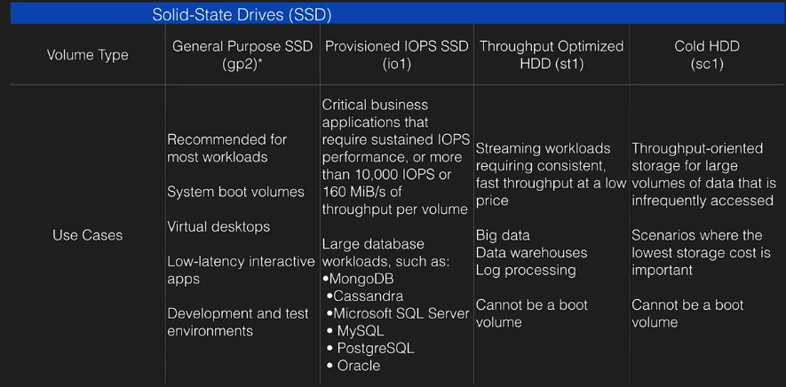

# EC2

VM in Cloud.

### EC2 pricing options
- on demand, by the hour (or by the second, linux only)
    * low cost adn flexibility without up-front payments
    * app with short term, spiky workloads
    * developing/testing apps
- reserved (1-3 year contracts, платить заранее)
    * steady state or predictable usage
    * app requires reserved capacity
    * upfront payments to reduce costs
        * Standard RI's (up to 75% off on demand)
        * Convertible RI's (up to 54% off on demand)
            * ability to change attributes of the RI
            * `>=` instance size
        * scheduled RI's (recurring load)
- spot instances
    * apps with flexible start and end times
    * apps that are only feasible at very low compute prices
    * urgent computing needs for large amounts of additional capacity
    * you terminate - you pay for the hour
    * AWS terminates - you get the hour it was terminated in for free
- dedicated hosts - physical EC2 servers (For licenses)
    * regulatory requirements
    * licensing without multi-tenancy support or cloud deployments
    * available on-demand (hourly)
    * 70% off with reserved instance

### DR MC GIFT PiX


- D - (DENSE) dense storage
- R - (RAM) memory optimized
- M - (MAIN) general purpose
- C - (CPU) compute optimized
- G - (Graphics) graphics optimized
- I - (IOPS) high speed storage
- F - (FPGA)
- T - lowest cost, general purpose
- P - (PICS) - graphics/general purpose GPU
- X - Extreme RAM - memory optimized

## Types

- HVM
- PV

## Security groups

Security groups are stateful.
- all inbound is blocked by default
- all outbound is allowed by default
- changes take effect immediately
- any number of EC2 instances within a security group
- multiple groups per EC2 instance
- no block rules

## Metadata

http://169.254.169.254/latest/meta-data/
http://169.254.169.254/latest/user-data/

## Gothas

- default action is for the EBS to be deleted when the instance is terminated
- termination protection is off by default
- can't encrypt boot volume for standard AMIs
- one subnet - one AZ
- 20 on-demand instances across the instance family by default
- Nitro hypervisor (new, foc C5) vs Xen
- SRV-IO on HVM AMI with drivers, ENA elastic network adapter
- no additional fee for enhanced networking

## AMIs

- AMIs are regional
- can copy between regions (console, command line, API)
- `CreateImage` API call creates an Amazon EBS-backed AMI from an Amazon EBS-backed instance that is either running or stopped. If you customized your instance with instance store volumes or EBS volumes in addition to the root device volume, the new AMI contains block device mapping information for those volumes. When you launch an instance from this new AMI, the instance automatically launches with those additional volumes.

## What is a cluster placement group?

A cluster placement group is a logical entity that enables creating a cluster of instances by launching instances as part of a group. The cluster of instances then provides low latency connectivity between instances in the group. Cluster placement groups are created through the Amazon EC2 API or AWS Management Console.

# Autoscaling

##  life-cycle hooks

50 hooks per group maximum

After you add lifecycle hooks to your Auto Scaling group, they work as follows:
- Responds to scale out events by launching instances and scale in events by terminating instances.
- Puts the instance into a wait state (`Pending:Wait` or `Terminating:Wait`). The instance is paused until either you continue or the timeout period ends.
- You can perform a custom action using one or more of the following options:
    - Define a CloudWatch Events target to invoke a Lambda function when a lifecycle action occurs. The Lambda function is invoked when Amazon EC2 Auto Scaling submits an event for a lifecycle action to CloudWatch Events. The event contains information about the instance that is launching or terminating, and a token that you can use to control the lifecycle action.
    - Define a notification target for the lifecycle hook. Amazon EC2 Auto Scaling sends a message to the notification target. The message contains information about the instance that is launching or terminating, and a token that you can use to control the lifecycle action.
    - Create a script that runs on the instance as the instance starts. The script can control the lifecycle action using the ID of the instance on which it runs.
- By default, the instance remains in a wait state for one hour, and then the Auto Scaling group continues the launch or terminate process (`Pending:Proceed` or `Terminating:Proceed`). If you need more time, you can restart the timeout period by recording a heartbeat. If you finish before the timeout period ends, you can complete the lifecycle action, which continues the launch or termination process.


### Wait State

- default timeout is 1 hour, max is 48 hours or 100 times * heartbeat timeout, whichever is smaller.
- adjust timeout with:
     - heartbeat timeout for hook when creating hook. Use `put-lifecycle-hook` command with `--heartbeat-timeout` parameter. Or use `PutLifecycleHook` op with `HeartbeatTimeout` param.
     - Continue to the next state with `complete-lifecycle-action` command or the `CompleteLifecycleAction` operation.
     - Restart timeout period by recording a heartbeat, using `record-lifecycle-action-heartbeat` command or the `RecordLifecycleActionHeartbeat` op. This increments the heartbeat timeout by the timeout value specified when you created the lifecycle hook. If the timeout is 1 hour, and you call this comamand after 30 minutes, the instance remains in a wait state for an additional hour.

### Action result

#### Continue

- Launching: success, can be put into service.
- Terminating: both ABANDON and CONTINUE allow instance to terminate, continue allows other lifecycle hooks to complete.

#### Abandon

- Launching: actions were unsuccessful, instance can be terminated
- Terminating: stops any remaining actions, such as other lifecycle hooks

### Spot Instances

hook doesn't prevent an instance from terminating due to a change in spot price. You must still complete lifecycle action.

## ASG Notifications

- Cloudwatch events
- SNS (-> SQS)

## Cooldowns and custom actions

The cooldown period is a configurable setting for your Auto Scaling group that helps to ensure that it doesn't launch or terminate additional instances before the previous scaling activity takes effect. After the Auto Scaling group dynamically scales using a simple scaling policy, it waits for the cooldown period to complete before resuming scaling activities.

Default cooldown is 300 seconds (5 minutes)

`scale out -> hoook -> 'Pending:Wait' -> scaling actions are suspended -> 'InService' -> cooldown starts -> resume scaling actions after cooldown
`

Amazon EC2 Auto Scaling **does not support** cooldown periods for step scaling policies

## Enter and Exit Standby
```
aws autoscaling enter-standby
aws autoscaling exit-standby
```

- Instance in an InService state can be moved toStandby state.
- Standby state enables you to remove the instance from service, troubleshoot or make changes to it, and then put it back into service.
- Instances in a Standby state continue to be managed by the Auto Scaling group. However, they are not an active part of the application until they are put back into service.

## Health Check

Health check grace period doesn't start until you complete the lifecycle hook and the instance enters the `InService` state.

## Scaling policy types

- target tracking scaling - scaling based on a target value for a specific metric.
  ```
  Configure a target tracking scaling policy to keep the average aggregate CPU utilization
  of your Auto Scaling group at 50 percent.
  ```
- step scaling - caling based on a set of scaling adjustments, known as step adjustments, that vary based on the size of the alarm breach
  ```
  After a scaling activity is started, the policy continues to respond to additional
  alarms, even while a scaling activity or health check replacement is in progress.
  Therefore, all alarms that are breached are evaluated by Amazon EC2 Auto Scaling
  as it receives the alarm messages.

  When you create a step scaling policy, you add one or more step adjustments that
  enable you to scale based on the size of the alarm breach. Each step adjustment
  specifies a lower bound for the metric value, an upper bound for the metric
  value, and the amount by which to scale, based on the scaling adjustment type.
  ```
- simple scaling - scaling based on a single scaling adjustment
  ```
  We recommend that you use step scaling policies instead of simple scaling policies
  even if you have a single step adjustment, because we continuously evaluate alarms
  and do not lock the group during scaling activities or health check replacements
  After a scaling activity is started, the policy must wait for the scaling activity
  or health check replacement to complete and the cooldown period to expire before
  it can respond to additional alarms.
  ```

### Scaling Adjustment Types

When a step scaling or simple scaling policy is executed, it changes the current capacity of your Auto Scaling group using the scaling adjustment specified in the policy. A scaling adjustment can't change the capacity of the group above the maximum group size or below the minimum group size.

#### ChangeInCapacity

Increase or decrease the current capacity of the group by the specified number of instances. A positive value increases the capacity and a negative adjustment value decreases the capacity.

Example: If the current capacity of the group is 3 instances and the adjustment is 5, then when this policy is performed, there are 5 instances added to the group for a total of 8 instances.

#### ExactCapacity

Change the current capacity of the group to the specified number of instances. Specify a positive value with this adjustment type.

Example: If the current capacity of the group is 3 instances and the adjustment is 5, then when this policy is performed, the capacity is set to 5 instances.

#### PercentChangeInCapacity

Increment or decrement the current capacity of the group by the specified percentage. A positive value increases the capacity and a negative value decreases the capacity. If the resulting value is not an integer, it is rounded as follows:
- Values greater than 1 are rounded down. For example, 12.7 is rounded to 12.
- Values between 0 and 1 are rounded to 1. For example, .67 is rounded to 1.
- Values between 0 and -1 are rounded to -1. For example, -.58 is rounded to -1.
- Values less than -1 are rounded up. For example, -6.67 is rounded to -6.

Example: If the current capacity is 10 instances and the adjustment is 10 percent, then when this policy is performed, 1 instance is added to the group for a total of 11 instances.

With **PercentChangeInCapacity**, you can also specify the minimum number of instances to scale (using the **MinAdjustmentMagnitude** parameter or **Add instances in increments of at least** in the console).

For example, suppose that you create a policy that adds 25 percent and you specify a minimum increment of 2 instances. If you have an Auto Scaling group with 4 instances and the scaling policy is executed, 25 percent of 4 is 1 instance. However, because you specified a minimum increment of 2, there are 2 instances added.

## Update policies

`UpdatePolicy` attribute specifies how AWS CloudFormation handles updates to the ASG resource

- AutoScalingReplacingUpdate
    ```
    This policy enables you to specify whether AWS CloudFormation replaces an Auto Scaling group
     with a new one or replaces only the instances in the Auto Scaling group.
    ```
- AutoScalingRollingUpdate
    ```
    Rolling updates enable you to specify whether AWS CloudFormation updates instances that
    are in an Auto Scaling group in batches or all at once.
    PauseTime - The amount of time that AWS CloudFormation pauses after making a change to a
    batch of instances to give those instances time to start software applications. If you
    enable the WaitOnResourceSignals property, PauseTime is the amount of time that AWS
    CloudFormation should wait for the Auto Scaling group to receive the required number of
    valid signals from added or replaced instances.
    ```
- AutoScalingScheduledAction
    ```
    With scheduled actions, the group size properties of an Auto Scaling group can change at
    any time. When you update a stack with an Auto Scaling group and scheduled action,
    AWS CloudFormation always sets the group size property values of your Auto Scaling group
    to the values that are defined in the AWS::AutoScaling::AutoScalingGroup resource of your
    template, even if a scheduled action is in effect.
    IgnoreUnmodifiedGroupSizeProperties - Specifies whether AWS CloudFormation ignores
    differences in group size properties
    ```

## ASG processes

- Launch
    ```
    If you suspend Launch, this disrupts other processes. For example, you can't return an instance
    in a standby state to service if the Launch process is suspended, because the group can't scale.
    ```
- Terminate
    ```
    If you suspend Terminate, this disrupts other processes.
    ```
- HealthCheck
    ```
    Checks the health of the instances. Amazon EC2 Auto Scaling marks an instance as unhealthy if
    Amazon EC2 or Elastic Load Balancing tells Amazon EC2 Auto Scaling that the instance is
    unhealthy. This process can override the health status of an instance that you set manually.
    ```
- ReplaceUnhealthy
    ```
    Terminates instances that are marked as unhealthy and later creates new instances to
    replace them. This process works with the HealthCheck process, and uses both the
    Terminate and Launch processes.
    ```
- AZRebalance
    ```
    If you suspend AZRebalance and a scale-out or scale-in event occurs, the scaling process
    still tries to balance the Availability Zones. For example, during scale-out, it launches
    the instance in the Availability Zone with the fewest instances.

    If you suspend the Launch process, AZRebalance neither launches new instances nor
    terminates existing instances. This is because AZRebalance terminates instances only
    after launching the replacement instances.

    If you suspend the Terminate process, your Auto Scaling group can grow up to ten percent
    larger than its maximum size, because this is allowed temporarily during rebalancing
    activities. If the scaling process cannot terminate instances, your Auto Scaling group
    could remain above its maximum size until you resume the Terminate process.
    ```
- AlarmNotification
    ```
    If you suspend AlarmNotification, Amazon EC2 Auto Scaling does not automatically execute
    policies that would be triggered by an alarm. If you suspend Launch or Terminate, it
    will not be able to execute scale-out or scale-in policies, respectively.
    ```
- ScheduledActions
    ```
    If you suspend Launch or Terminate, scheduled actions that involve launching or
    terminating instances are affected.
    ```
- AddToLoadBalancer
    ```
    If you suspend AddToLoadBalancer, Amazon EC2 Auto Scaling launches the instances but does
    not add them to the load balancer or target group. If you resume the AddToLoadBalancer
    process, it resumes adding instances to the load balancer or target group when they are
    launched. However, it does not add the instances that were launched while this process
    was suspended. You must register those instances manually.
    ```

# EBS

- EBS are placed in a specific AZ, where they are automatically replicated. (Not to different AZ, but between SANs)
- cannot mount to multiple instances
- EC2 and EBS volume have to be in the same AZ
- can't modify standard volume, can change volume size and storage type on the fly

## Bootable:
- Magentic standard (bootable)
- GP2
- IO1

## Volume types

- GP2, general purpose SSD
    * 3 IOPS per GB with up to 10k IOPS, burst up to 3k IOPS
    * up to 160 MB/s
- Provisioned IOPS SSD (IO1)
    * I/O intensive
    * if you need >10k IOPS
    * provision up to 20k IOPS
    * up to 320 MB/s
    * 30 IOPS per GB of storage max
- Throughput optimized HDD (ST1)
    * big data
    * data warehouses
    * Log processing
    * sequential data
    * cannot be a boot volume
- Cold HDD (SC1)
    * low cost
    * file server
    * cannot be a boot volume
- Magnetic (Standard)
    * bootable
    * lowest cost




## Bursting

I/O Credits

when required more than the baseline performance I/O, EBS will use I/O credits to burst performance level, up to 3k IOPS

- 5400000 I/O credits initially
- enough for 3k IOPS for 30 minuntes
- earn credits when not going over provisioned IO level

## Snapshots

- snapshots exist on S3
- snapshots are point in time copies of volumes
- snapshots are incremental
- you can create AMIs from volumes and snapshots
- to move EC2 volume from one AZ/region to another - take a snap or an image, then copy it to the new region
- snaps of encrypted volumes are encrypted automatically
- volumes restored from encrypted snapshots are encrypted automatically
- you can share snapshots, but only unecrypted
    * snap can be shared with other AWS accounts or made public
- snapshot for root EBS volumes -> stop the instance before taking the snapshot

## Instance store

- Ephemeral storage
- can't stop. If the underlying host fails - will lose data
- EBS backed can be stopped
- Can reboot both

## Pre-warming EBS volumes

Restoring volumes from snapshots -> read all block from volume before using -> pre-warming

## Cloudwatch metrics

- Read|Write Byets
- Read|Write Ops
- Total Read|Write Time
- IdeTime
- *QueueLength* - number of IO waiting to be completed
- ThroughputPercentage
- ConsumedReadWriteOps

## Status checks

- ok
- warning
    ```
    (severely) degraded, but available
    ```
- impaired (stalled/not available)
    ```
    volume offline/pending recovery, or waiting for the user to enable I/O

    ```
- insufficient-data

## Modifying EBS volumes

- online size change
- change volume type or adjust IOPS performance

----------

## Links

- https://docs.aws.amazon.com/AWSEC2/latest/UserGuide/Storage.html
- https://docs.aws.amazon.com/AWSEC2/latest/UserGuide/monitoring-volume-status.html
- https://docs.aws.amazon.com/AWSEC2/latest/UserGuide/ebs-initialize.html

### to-do
- EC2 snapshots, data migration