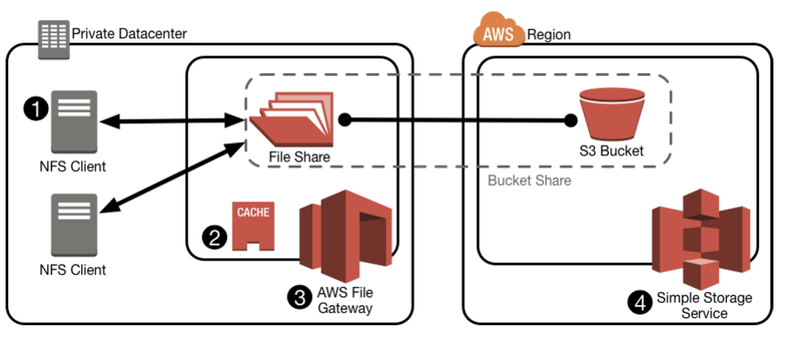

# AWS storage gateway

The file gateway is deployed in the form of a virtual appliance that can run either in a VMware environment or in an Amazon Elastic Compute Cloud (Amazon EC2) instance in AWS

A “bucket share” consists of an NFS share hosted from a file gateway across a single Amazon S3 bucket. VA supports up to 10 bucket shares.

* NFS to Amazon S3 from on-premises apps
* read/write cache on local storage (least recenlty used algorithm)
* no object locking/coherency across file gateways
* RefreshCache API to recognize changes in S3 bucket made by other contributors
* Glacier files are visible, but not readable.
* Can be deployed on premise (ESXi, Hyper-V), or as an EC2 instances
* can schedule snapshots
* can use with direct connect
* can implement bandwidth throttling



Types:
* File interface gateway (NFS)
    * max file size - 5TB
* Volume interface (iSCSI based block storage)
    * gateway-cached volumes
        ```
        data in S3, frequently accessed data locally
        max volume size 32 Tb, max 32 volumes
        data volume for local cache and an upload buffer
        snapshot -> gateway-cached volume
        ```
    * gateway-stored volumes
        ```
        primary data locally, backs up PIT snapshots to S3
        max volume size 16Tb, max 32 volumes
        entire data set + upload buffer
        snapshot (manual/scheduled) -> amazon ebs snapshot -> gateway stored volume/Amazon EBS volume
        ```
* tape interface (iSCSI based virtual tape solution)
    * gateway-virtual tape library
        ```
        virtual tape library - S3, max 1500 tapes (netbackup, backup exec, veeam BR, SCDPM, Dell NetVault Backup), instant access
        virtual tape shelf - glacier, unlimited tapes (long recovery times, 24 hours for retrieval)
        ```
