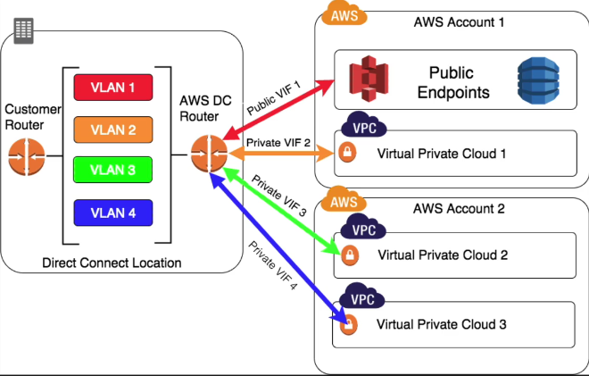
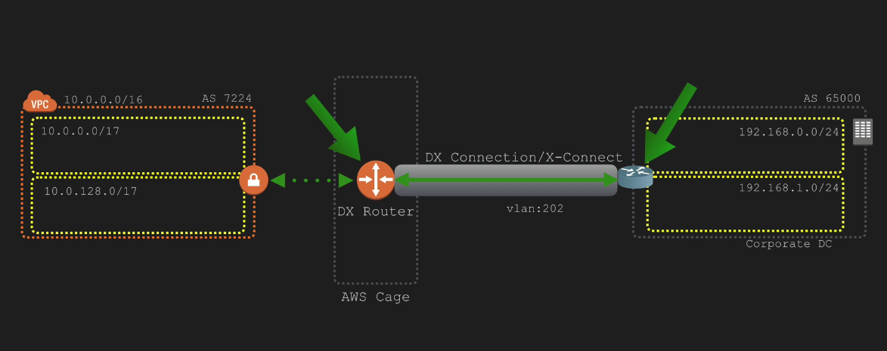

# AWS Direct Connect

FAQ - √

Private connection to AWS DC, does not involve the Internet.

- 802.1q VLANs
- More reliable than IPSec VPN
- no redundancy (use s2s VPN and BGP)
- AWS region can have more than one DX location

Advantages:
- reduced bandwidth costs
- consistent network performance
- AWS Services compatibility
- private connection to VPC
- elastic

Virtual interfaces:
- required for each DC
- each DC can be configured with one or more virtual interfaces
- public VI can be created to connect to public resources which are reachable publicly only
- each VI needs a VLAN ID, interface IP address, ASN and BGP Key
- to use your DC with another AWS account, you can create a hosted VI for that account. These hosted VI work the same as standard VI and can connect to public resources or a VPC

## Private/Public VIFs

single direct connect connection could be used to connect to VPCs in different accounts

### private VIFs

- new VIF -> new BGP session
- Amazon advertises VPC CIDR
- BGP key is not mandatory and could be generated
- VIF is terminated on VGW attached to VPC

### public VIFs

- Access public endpoints (S3, DynamoDB) via public VIF
- public uniq IP range required between DX router and customer router, could be delegated by AWS, public AS number recommended
- VLAN required
- AWS advertises public services IP ranges to customer router
- customer router advertises public IP range used router to AWS
- must specify prefixes you want to advertise (AWS verifies these manually)

## CloudFront

Amazon CloudFront supports custom origins including origins you run outside of AWS. Through Direct Connect, customer traffic will remain in Amazon's backbone network after it enters it. Therefore, prefixes of CloudFront locations that are not on the Amazon backbone network will not be advertised through Direct Connect.

## Connection speeds

### connection standards
1000Base-LX
10GBASE-LR

### available connection bandwidth
1Gbps and 10Gbps ports are available. Speeds of 50Mbps, 100Mbps, 200Mbps, 300Mbps, 400Mbps, and 500Mbps can be ordered from any APN partners supporting AWS Direct Connect

### partner connections

- partner own shared connection between partner router and DX router
- no Multi-VLAN capable trunk
- hosted connection, pre-assigned VLAN
    - -> public/private VIF, or Hoster VIF

## Q. Can I extend one of my VLANs to the AWS Cloud using AWS Direct Connect?

No, VLANs are utilized in AWS Direct Connect only to separate traffic between virtual interfaces.

## Q: Can I connect to the Internet via this connection?

No.

## Q. What’s the max number of links I can have in a LAG group?

The maximum number of links will be 4x in a LAG group.